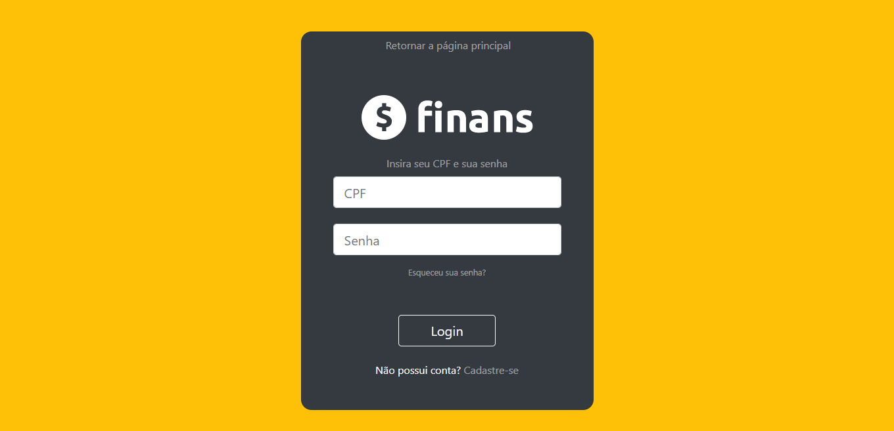

# FINANS UI

Simples UI for a fictional finances website, made as part of a webdev course.

3 pages in total, with a login and register page using Bootstrap for a responsive design, and a input mask made in JavaScript for some needed fields. 

